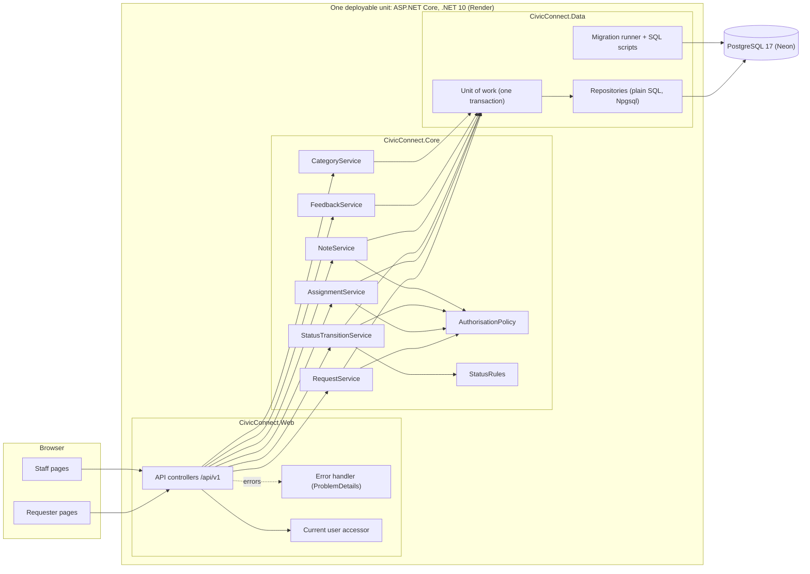
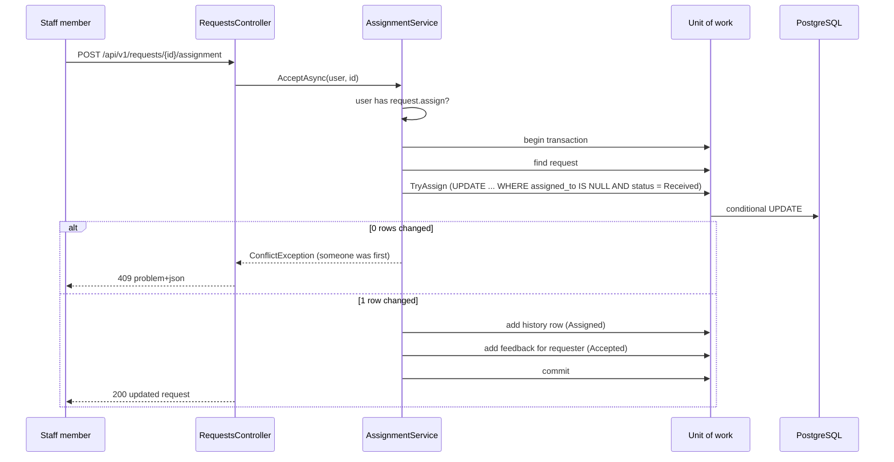

# CivicConnect Backend Architecture (M2)

**Owner:** K. Marota (Systems Architect & Backend Lead)
**Supports:** ADR-001, ADR-002, ADR-003, ADR-006, ADR-007
**Status:** Proposed for the M2 Architecture, Technology & Initial Design Baseline

---

## 1. Why this document exists

The ADRs explain *why* we chose what we chose. This document shows what those choices look like as a working backend, so that anyone (a teammate, an assessor, or us in three weeks) can find their way around the code without reading seven ADRs first. Where a reason is needed, it points to the ADR instead of repeating it.

## 2. The shape in one paragraph

CivicConnect is a **modular monolith**: one ASP.NET Core application on .NET 10 LTS, deployed as a single unit, talking to one PostgreSQL 17 database. Inside the application the code is split into three layers that match D-001: **Web** (API controllers now, Razor Pages from the UI side), **Core** (business rules and services) and **Data** (SQL and repositories). These are *logical* layers, separate projects in one process. Physically there are only two boxes: the app on Render and the database on Neon (ADR-007).

We did not split this into services because nothing in ASR-01 to ASR-06 asks for it. The hardest correctness rule (ASR-01, one owner per request) is far easier to guarantee with one local database transaction than across a network boundary, and ASR-05 says the team must be able to build and run this on free plans. A separate reporting database was also rejected, because NFR-008 needs reports to match the request records exactly, and a second copy of the data is one more thing that can drift.

## 3. Component diagram



The Razor Pages that Mogau builds sit in the Web project and call the same services (or the same API), so there is still only one place where rules live.

## 4. Who does what

| Component | Layer | Responsibility | Main requirements |
| :-- | :-- | :-- | :-- |
| API controllers | Web | Turn HTTP into a service call and the result back into JSON. No business rules. | all API-backed FRs |
| Current user accessor | Web | Works out who is calling. Placeholder in Development only until ADR-005 / CR-003 settles sign-in. | FR-020, NFR-006 |
| Error handler | Web | Maps our exceptions to the error shape in the API contract. Never leaks internals on a 500. | ADR-006 |
| RequestService | Core | Submit, view, list own history, staff queue. Validates input, applies visibility rules. | FR-001 to FR-005, FR-008 to FR-010 |
| AssignmentService | Core | Accept a request. One transaction: owner, status, history, feedback. | FR-011, NFR-005 |
| StatusTransitionService | Core | Move a request along the allowed lifecycle, record it, tell the requester. | FR-012, FR-014, FR-007 |
| NoteService | Core | Add an append-only action or resolution note. | FR-013, NFR-007 |
| FeedbackService | Core | Read and mark the requester's in-app feedback. | FR-007 |
| CategoryService | Core | Give the controlled category list to the form. | FR-002 |
| AuthorisationPolicy | Core | The one place that answers "may this person do this / see this?". | NFR-003, NFR-006 |
| StatusRules | Core | The allowed status transitions, in one small table. | FR-012, ASR-01 |
| Unit of work | Data | Opens one connection and one transaction, commits or rolls back. | ADR-002 |
| Repositories | Data | Plain parameterised SQL. Includes the conditional UPDATE for assignment. | ADR-002 |
| Migration runner | Data | Applies numbered SQL scripts once, in order. | RSK-006 |

## 5. Where each rule is checked

We agreed in Assignment 2 that no single layer should carry a rule alone. This is how that landed in the code:

| Rule | Screen | Backend (Core) | PostgreSQL |
| :-- | :-- | :-- | :-- |
| Only staff may accept a request | hide the button | `AuthorisationPolicy` (main check) | none |
| Status change must be valid | show valid actions | `StatusRules` (main check) | `CHECK` on the status values |
| Request not already owned | show the owner | clear 409 message | conditional `UPDATE ... WHERE assigned_to IS NULL` |
| Owner and status agree | none | service logic | `CHECK` (Received/Rejected means no owner) |
| History cannot be changed | no edit screen | no update or delete method exists | trigger blocks UPDATE and DELETE |
| Field lengths and required fields | inline messages | field-by-field validation | `NOT NULL` and length `CHECK`s |
| A requester never sees another's request | none | `AuthorisationPolicy` + 404 | `requester_id` on every read |

## 6. Walk-through: accepting a request (FR-011, the M2 trace)



In words:

1. The controller finds out who is calling and hands over to the service. It makes no decisions itself.
2. The service checks the permission first, so unauthorised callers never touch the database.
3. It opens one transaction and reads the request.
4. The claim is a single conditional `UPDATE`. If two staff press "accept" at the same moment, PostgreSQL lets exactly one of them change the row; the other gets zero rows back and receives a 409.
5. Only after the claim succeeds do the history row and the requester's feedback get written, inside the same transaction. If anything fails, the whole thing rolls back, so a request can never be assigned without its history entry.
6. Waiting on the user (clicking, reading the queue) happens outside the transaction, so it stays short.

## 7. What failure looks like

| Situation | What happens | Status |
| :-- | :-- | :-- |
| Missing or too-long field | Nothing saved, each field named in the response | 400 |
| Not signed in | Refused | 401 |
| Signed in but lacking the permission | Refused, nothing changed | 403 |
| Requester asks for someone else's request | Same answer as "does not exist" | 404 |
| Second staff member accepts an owned request | Refused with a plain message | 409 |
| Invalid transition (Received to Closed) | Refused, message says which move is not allowed | 409 |
| Two people change the status at once | The slower one is refused and told to refresh | 409 |
| Anything unexpected | Generic message, details only in the server log | 500 |

## 8. Solution layout

```text
src/
  CivicConnect.Core/        rules, models, services (no database code, no ASP.NET)
    Models/  Abstractions/  Services/  Rules/
  CivicConnect.Data/        Npgsql repositories, unit of work, migrations
    Migrations/*.sql
  CivicConnect.Web/         controllers, error handling, Program.cs (Razor Pages join here)
tests/
  CivicConnect.Tests/       unit tests with in-memory fakes + one real-database concurrency test
db/
  dev_seed.sql              sample users for local work only
```

`Core` does not reference `Data` or `Web`. That is what keeps the rules testable without a database and is the concrete form of D-001.

## 9. Deliberately not built yet

| Left out | Why | Where it lands |
| :-- | :-- | :-- |
| Real sign-in | Waiting on ADR-005 / CR-003 (Gerald) | Replaces the dev-only user accessor |
| Manager, admin and sponsor endpoints | Not in Build Slice 1 | M3 |
| Reporting queries | Same | M3 |
| Separate audit log table | Slice 1 history covers request actions; admin actions need it later | M3 |
| Attachments | FR-006 deferred | Forward consideration |
| Email/SMS | Deferred by C-4 | Forward consideration |
| Push updates | Polling is enough for NFR-002 | Forward consideration |
