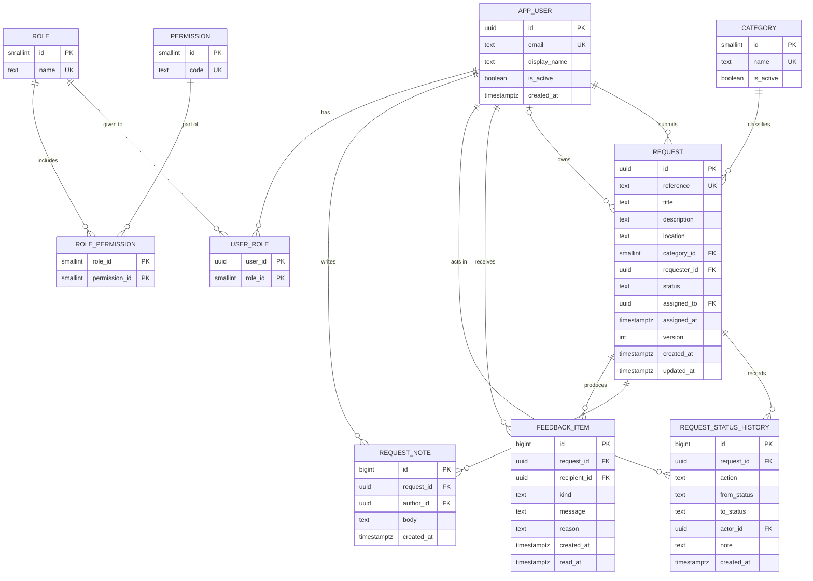

# CivicConnect Data Model and Persistence Baseline (M2)

**Owner:** K. Marota
**Supports:** ADR-002 (integrity), ADR-003 (PostgreSQL 17.x), ADR-007 (Neon), ASR-01, ASR-02, ASR-03, ASR-04
**Status:** Proposed for the M2 baseline. SQL lives in `src/CivicConnect.Data/Migrations/`.

---

## 1. Why a relational database

The data is highly connected: a request has one requester, one category, at most one owner, and many history rows, notes and feedback items. The rules we care about most (one owner, no lost updates, history that cannot be edited) are exactly what transactions, foreign keys, `CHECK` constraints and conditional updates are for. Reporting is just grouping and counting the same tables, which SQL does well. The volume is small (NFR-004 targets 1,000 requests). Nothing here needs a document store or a cache, and ASR-05 pushes us toward one database we can run for free.

| Access pattern | Who | Handled by |
| :-- | :-- | :-- |
| Create a request | Requester | insert into `request` + history row |
| "My requests", optionally by status | Requester | `ix_request_requester` |
| Staff queue by status/category/owner | Staff | `ix_request_queue` |
| Open one request with its history | Staff | primary key + `ix_history_request` |
| Accept a request | Staff | conditional UPDATE on `request` |
| Feedback for me | Requester | `ix_feedback_recipient` |
| Counts by status/category | Management (M3) | grouping on `request`, same indexes |

## 2. Entity relationship diagram

## 3. Entities, ownership and lifecycle

"Owner" here means which part of the backend is allowed to write the table.

| Table | What it holds | Written by | Lifecycle |
| :-- | :-- | :-- | :-- |
| `app_user` | Person, active flag. No password column yet (ADR-005). | User management (M3), dev seed | Deactivated, never deleted, so old history still points somewhere |
| `category` | Controlled list for FR-002 | Category maintenance (M3), seed | Retired with `is_active = false`, never deleted, so old requests keep their category |
| `request` | The request and its current state | `RequestService`, `AssignmentService`, `StatusTransitionService` | Received, then Assigned, In Progress, Resolved, Closed (or Rejected from Received). Never deleted |
| `request_status_history` | One row per submission, assignment or status change | Same services, in the same transaction | Append-only, kept for good |
| `request_note` | Staff notes and resolution information | `NoteService` | Append-only |
| `feedback_item` | In-app messages for the requester | Assignment and transition services | Created with the change; only `read_at` is ever updated |
| `role`, `permission`, `role_permission`, `user_role` | RBAC data (ADR-005) | Seeded now, admin screens in M3 | Changed by administrators |

## 4. Constraints that protect business correctness

| Rule | Constraint | Requirement |
| :-- | :-- | :-- |
| Status is one of a fixed set | `ck_request_status` | FR-012, ASR-01 |
| Required fields are present and not blank | `NOT NULL` + `ck_request_title / description / location` | AC-001.2 |
| Every request has a real, active-at-the-time category | `category_id NOT NULL` + foreign key | FR-002 |
| Reference is unique and generated by the database | `uq_request_reference` + sequence default | AC-001.1 |
| Owner and timestamp go together | `ck_request_owner_pair` | FR-011 |
| A request that is Received or Rejected has no owner; every other status has one | `ck_request_owner_vs_status` | FR-011, NFR-005 |
| Claiming a request only works if it is still unowned | conditional `UPDATE ... WHERE assigned_to IS NULL AND status = 'Received'` | NFR-005 |
| Two status changes cannot both win from the same starting status | `UPDATE ... WHERE status = <what we read>` | NFR-005 |
| History and notes cannot be edited or deleted | `trg_*_append_only` triggers | NFR-007, ASR-03 |
| Feedback for a rejection must carry a reason | `ck_feedback_reason` | AC-007.2 |

The conditional `UPDATE` is the recommendation from Assignment 2 (R2-2). The `version` column is bumped on every change so a later feature that needs "save only if unchanged" has something to use.

## 5. Indexes

| Index | Columns | Serves |
| :-- | :-- | :-- |
| `uq_request_reference` | `reference` | AC-001.1 unique reference |
| `ix_request_requester` | `requester_id, status, created_at DESC` | FR-004, FR-005 |
| `ix_request_queue` | `status, category_id, assigned_to` | FR-008, FR-009 |
| `ix_request_created` | `created_at` | sorting, NFR-004 |
| `ix_history_request` | `request_id, created_at` | FR-010 |
| `ix_note_request` | `request_id, created_at` | FR-010 |
| `ix_feedback_recipient` | `recipient_id, created_at DESC` | FR-007 |

We are deliberately not adding a cache (A2 R2-4). If the 3-second target is missed at 1,000 seeded requests, indexes and query shape come first.

## 6. Migrations

Plain SQL files, applied once and in order by a small runner that records them in `schema_migration`. The first three keep the names already used in the RTM.

| File | Contents |
| :-- | :-- |
| `001_request.sql` | `app_user`, `category`, `request` with checks and indexes |
| `002_category.sql` | Seed of the starting category list (content still to be confirmed, CR-008) |
| `003_assignment.sql` | Owner columns, `request_status_history`, `request_note`, append-only triggers, queue index |
| `004_feedback.sql` | `feedback_item` |
| `005_rbac.sql` | `role`, `permission`, `role_permission`, `user_role` and a draft starting matrix |

The `app_user` table is created in 001 because `request.requester_id` has to point at something from day one.

## 7. Size, availability and backup

At the volumes in the PED (thousands of requests, roughly five to ten history rows each) the data is tiny. The realistic concerns are not scale.

* **Single point of failure.** One Neon instance is the SPOF for the whole product. We accept this on purpose: a replica or failover costs money (ASR-05) and the Sponsor has not asked for high availability. It is recorded as a risk, not hidden.
* **Scaling if it ever mattered.** The order would be: check indexes, add connection pooling, move up a plan, and only then consider read replicas for the reporting queries. Nothing in the current schema blocks that path.
* **Backup and recovery.** We rely on the managed provider's restore feature on the free plan. The exact restore window and limits must be read from Neon's own documentation and written into the ADR-007 evidence before baseline sign-off (RSK-015). As a fallback we can run a scheduled `pg_dump`; that is recorded as a forward consideration, not built.
* **Sensitive data.** Requests can contain personal information. Nothing sensitive is committed to the repo; the connection string comes from configuration only (RSK-005).

## 8. Pending schema changes (not applied)

| Change | Trigger | Draft |
| :-- | :-- | :-- |
| Target response time so "overdue" can be defined | CR-005 approved | `ALTER TABLE request ADD COLUMN target_response_at timestamptz;` then compare with `now()` in reporting |
| Credentials or identity link columns on `app_user` | ADR-005 / CR-003 | Depends on the mechanism Gerald settles on |
| Rejected status | Proposed **CR-009** (see below) | Already allowed by `ck_request_status` so no migration is needed |
| Admin action audit table | M3 (FR-022) | `audit_log` mirroring the history table pattern |

**Why CR-009.** FR-007 says a requester is told when a request is *rejected*, with a reason (AC-007.2). FR-012 lists the lifecycle as Received, Assigned, In Progress, Resolved, Closed, and says Received to Closed is invalid (AC-012.2). Rejection therefore has no place in the baselined lifecycle. The backend treats it as a separate terminal status reachable only from Received, with a mandatory reason. That is a small change to the M1 lifecycle, so it should go through change control before the baseline is signed.
